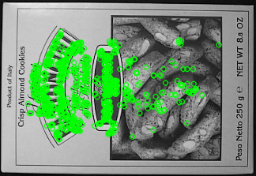
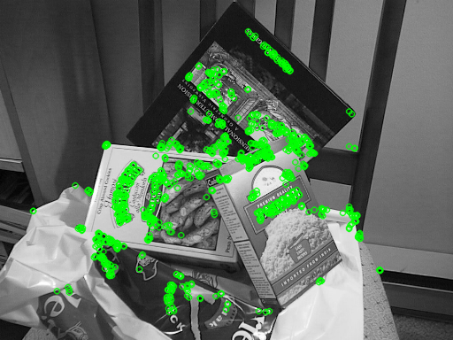
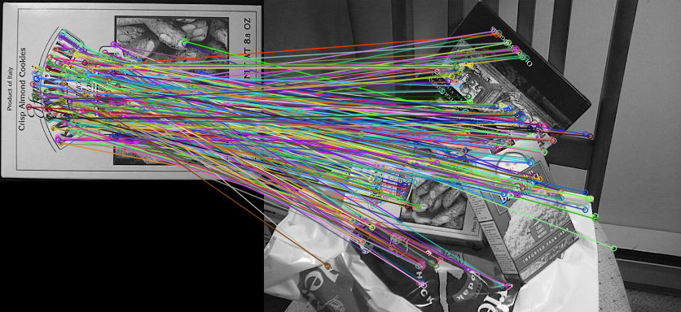
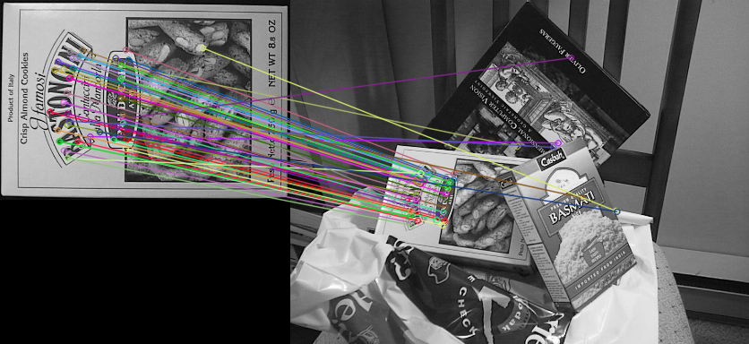
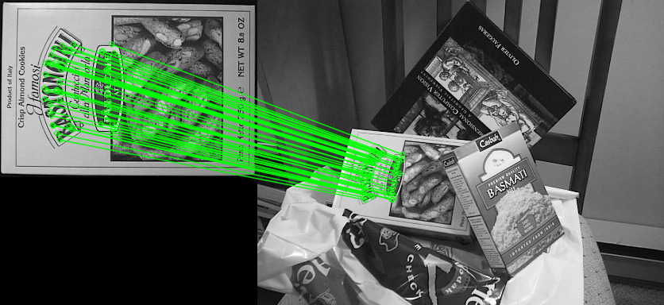
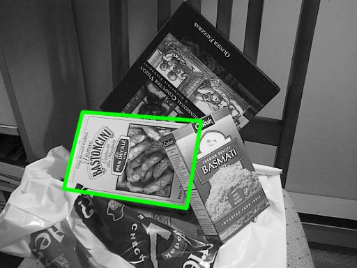
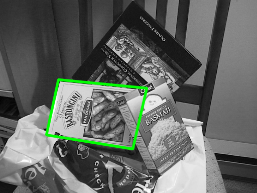
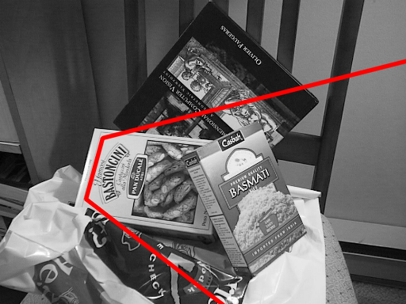
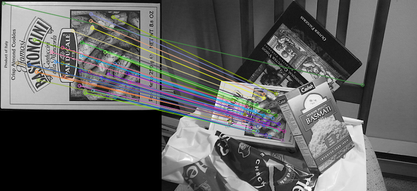
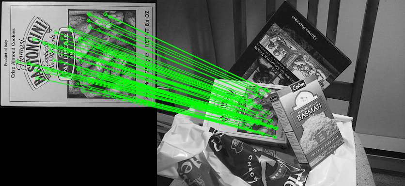

# 基于 OpenCV 的局部特征检测、描述与图像匹配实验报告

## 一、实验结果

### 任务 1：ORB 特征检测与描述

- ORB 参数：`cv2.ORB_create(nfeatures=1000)`
- `box.png` 关键点数量：865
- `box_in_scene.png` 关键点数量：1000
- `box.png` 描述子维度：(865, 32)
- `box_in_scene.png` 描述子维度：(1000, 32)
- 单个 ORB 描述子长度：32 字节

**box.png 的 ORB 特征点可视化**

图片文件：`outputs/task1_box_orb_keypoints.png`



**box_in_scene.png 的 ORB 特征点可视化**

图片文件：`outputs/task1_box_in_scene_orb_keypoints.png`



### 任务 2：ORB 特征匹配

- 匹配器：`cv2.BFMatcher(cv2.NORM_HAMMING, crossCheck=True)`
- 排序方式：按匹配距离 `distance` 从小到大排序
- 总匹配数量：287
- 可视化数量：前 50 个匹配

**ORB 全部初始匹配图**

图片文件：`outputs/task2_orb_all_initial_matches.png`



**ORB 前 50 个匹配可视化结果**

图片文件：`outputs/task2_orb_top50_initial_matches.png`



### 任务 3：RANSAC 剔除错误匹配

- Homography 函数：`cv2.findHomography()`
- RANSAC 方法：`cv2.RANSAC`
- 重投影误差阈值：5.0
- 总匹配数量：287
- RANSAC 内点数量：52
- 内点比例：0.181

Homography 矩阵：

```text
[0.434400, -0.127125, 117.960351]
[-0.017337, 0.462978, 160.111717]
[-0.000337, -0.000127, 1.000000]
```

**RANSAC 后的 ORB 内点匹配图**

图片文件：`outputs/task3_orb_ransac_inlier_matches.png`



### 任务 4：目标定位

- 角点来源：`box.png` 的左上、右上、右下、左下四个角点
- 角点投影：`cv2.perspectiveTransform()`
- 边框绘制：`cv2.polylines()`
- 是否成功定位：成功
- 简要说明：绿色四边形能够覆盖场景图中 `BASMATI` 盒子正面区域，定位成功。

**box_in_scene.png 中画出目标边框的结果图**

图片文件：`outputs/task4_orb_object_location.png`



### 任务 6：参数对比实验

参数记录：

| nfeatures | 模板图关键点数 | 场景图关键点数 | 匹配数量 | RANSAC 内点数 | 内点比例 | 是否成功定位 |
| --------: | -------------: | -------------: | -------: | ------------: | -------: | :----------: |
|       500 |            453 |            500 |      149 |            32 |    0.215 |     成功     |
|      1000 |            865 |           1000 |      287 |            52 |    0.181 |     成功     |
|      2000 |           1589 |           1999 |      511 |            66 |    0.123 |     失败     |

1. 不同 `nfeatures` 对匹配数量的影响：随着 `nfeatures` 从 500 增加到 1000、2000，模板图和场景图的关键点数量增加，匹配数量也从 149 增加到 287 和 511。
2. 不同 `nfeatures` 对 RANSAC 内点比例的影响：内点比例分别为 0.215、0.181、0.129，并不是随着特征点数量增加而单调提高。
3. 是否特征点越多定位效果就一定越好：不是。特征点更多会带来更多候选匹配，但也可能增加重复纹理、背景区域和不稳定点，导致错误匹配增加。定位效果更依赖匹配点的区分性和几何一致性。本实验中三组参数都能定位成功，但 `nfeatures=2000` 的内点比例最低，说明特征点越多不一定更好。

参数定位图：

**nfeatures=500 的目标定位结果**

图片文件：`outputs/task6_orb_nfeatures_500_location.png`



**nfeatures=1000 的目标定位结果**

图片文件：`outputs/task6_orb_nfeatures_1000_location.png`


**nfeatures=2000 的目标定位结果**

图片文件：`outputs/task6_orb_nfeatures_2000_location.png`



### 选做任务：SIFT 特征匹配

| 方法 | 匹配数量 | RANSAC 内点数 | 内点比例 | 是否成功定位 | 运行速度主观评价                      |
| :--- | -------: | ------------: | -------: | :----------: | :------------------------------------ |
| ORB  |      287 |            52 |    0.181 |     成功     | 本次耗时约 101.0 ms，初始匹配数量更多 |
| SIFT |       80 |            75 |    0.938 |     成功     | 本次耗时约 80.4 ms，内点比例更高      |

**SIFT Lowe ratio test 后前 50 个匹配**

图片文件：`outputs/optional_sift_top50_good_matches.png`



**SIFT RANSAC 后内点匹配**

图片文件：`outputs/optional_sift_ransac_inlier_matches.png`



**SIFT 目标定位结果**

图片文件：`outputs/optional_sift_object_location.png`


## 二、必须回答的问题

### 问题 1：什么是特征点？

1. 特征点是图像中具有明显局部变化、容易被重复检测到的位置，例如角点、边缘交汇处、文字笔画交叉处和纹理丰富区域。结合 `box.png` 的实验结果，特征点主要分布在盒子文字、边框、图案边缘、黑白块交界和饼干纹理区域。
2. 文字、角点、纹理丰富区域容易产生特征点，是因为这些地方在局部邻域内灰度变化明显，不同方向上的像素差异较大，局部结构具有较强区分性。
3. 大面积平坦区域通常没有明显特征点，是因为这些区域灰度变化很小，邻域之间相似度高，不容易稳定地区分和重复检测。

### 问题 2：什么是特征描述子？

1. 描述子和关键点的区别：关键点表示“特征在哪里”，主要包含位置、尺度、方向等信息；描述子表示“这个特征附近长什么样”，用一组数值编码关键点邻域的外观。
2. 只知道关键点位置还不够，因为两幅图像的拍摄角度、距离和位置可能不同，同一物体点在两张图中的坐标会变化。描述子可以用来比较局部外观相似性，从而判断哪些关键点可能对应同一位置。
3. ORB 描述子的输出维度是 `(关键点数量, 32)`，因此单个 ORB 描述子的长度是 32 字节。
4. ORB 描述子是二进制描述子，是因为它基于 BRIEF 的思想，通过比较关键点邻域中成对采样点的亮度大小，把结果编码为 0 和 1。

### 问题 3：为什么 ORB 使用 Hamming distance？

1. ORB 描述子的基本结构是一串二进制位，每一位表示一对采样点亮度比较的结果。
2. Hamming distance 衡量的是两串二进制码中不同位的数量，也就是有多少个 bit 不相同。
3. ORB 不使用普通欧氏距离，是因为 ORB 描述子不是连续浮点向量，而是二进制码。用按位异或并统计不同位数量更符合数据结构，也更快。

### 问题 4：ORB 为什么对旋转、平移和一定尺度变化具有鲁棒性？

1. 描述子在关键点局部邻域中计算，因此图像整体平移时，只要同一局部结构仍能被检测到，它的局部外观描述仍然相似，所以对平移比较鲁棒。
2. ORB 通过关键点邻域的方向估计获得主方向，再根据该方向旋转 BRIEF 采样模式，从而增强旋转鲁棒性。
3. ORB 通过图像金字塔在不同尺度图像上检测关键点，使它对一定范围内的尺度变化具有鲁棒性。
4. ORB 不能完全抵抗透视变换。透视变换会导致局部区域出现非均匀拉伸、压缩和形变，超过了简单旋转和尺度变化的范围。

### 问题 5：为什么初始匹配中会有错误匹配？

1. 错误匹配通常出现在重复纹理、相似文字、相似图案、背景干扰、遮挡和低纹理区域附近。
2. 重复纹理、相似图案和背景干扰会导致不同位置的局部描述子非常相似，匹配器只根据描述子距离判断时，就可能把不同物体或不同位置错误连在一起。
3. 匹配距离越小不一定就是正确匹配。距离小只说明局部外观相似，但不保证这些点满足整体几何关系，也不保证它们来自同一个真实物体平面。

### 问题 6：RANSAC 的作用是什么？

1. RANSAC 通过反复随机选择少量匹配点估计 Homography，再统计所有匹配点中哪些点符合该几何模型，从而剔除错误匹配。
2. RANSAC 使用的主要依据是几何一致性，而不是描述子相似性。描述子相似性用于产生初始匹配，RANSAC 用几何关系筛选这些匹配。
3. inlier 是符合估计模型、重投影误差较小的匹配点。
4. outlier 是不符合估计模型、重投影误差较大的匹配点，通常对应错误匹配。
5. RANSAC 后的匹配线明显更合理，是因为不满足同一平面透视投影关系的错误连线被剔除了，剩下的内点集中在盒子正面区域。

### 问题 7：Homography 的意义是什么？

1. Homography 描述两幅图像中同一平面之间的透视投影关系，可以把一幅图像中的平面点映射到另一幅图像中。
2. `box.png` 和 `box_in_scene.png` 适合使用 Homography，是因为实验目标是盒子正面，该区域可以近似看作平面。
3. Homography 更适合平面物体。对于平面上的所有点，可以用同一个 3x3 投影矩阵描述映射关系；立体物体不同部分深度不同，通常不能由单个 Homography 完整描述。
4. 如果场景中物体不是平面，Homography 可能只能对齐其中一个表面，其他深度区域会出现偏移、拉伸或错位，目标边框也可能不准确。

### 问题 8：SIFT 和 ORB 有什么区别？

1. ORB 描述子是二进制向量，通常每个描述子 32 字节；SIFT 描述子是 128 维浮点梯度直方图。
2. ORB 使用 Hamming distance，是因为它比较的是二进制位之间的差异。
3. SIFT 使用 L2 distance，是因为 SIFT 描述子是连续浮点向量，欧氏距离适合衡量这种向量之间的差异。
4. SIFT 通常比 ORB 更稳定，是因为它的尺度空间检测和梯度方向直方图描述更细致，对尺度、旋转和光照变化的鲁棒性更强。
5. ORB 通常比 SIFT 更快，是因为 ORB 使用 FAST 关键点和二进制描述子，描述子计算和 Hamming 匹配都很高效。
6. 在本实验中，SIFT 的效果更稳定：SIFT 匹配数量为 80，RANSAC 内点比例为 0.938；ORB 匹配数量为 287，RANSAC 内点比例为 0.181。两者都能成功定位，但 SIFT 的内点比例更高，ORB 的初始匹配数量更多。

### 问题 9：SIFT 是否抗透视变换？

1. SIFT 主要抗尺度变化、旋转变化、一定光照变化和小范围视角变化。
2. SIFT 不严格抗透视变换。透视变换会造成局部区域的非均匀形变，SIFT 本身不能完全消除这种影响。
3. SIFT 对小范围视角变化有一定鲁棒性，是因为小角度视角变化下局部梯度分布变化不大，描述子仍可能保持相似。
4. 大角度透视变化下，局部区域会明显压缩、拉伸或遮挡，梯度结构发生较大改变，SIFT 匹配仍可能失败。
5. 在本实验中，真正处理整体透视变化的是 RANSAC + Homography。SIFT/ORB 主要负责提供候选特征匹配点，整体投影关系由 Homography 建模。

### 问题 10：实验总结

1. 本实验完成了基于 OpenCV 的局部特征检测、描述、匹配、错误匹配剔除和目标定位。实验使用 `box.png` 作为模板图，使用 `box_in_scene.png` 作为场景图，最终在场景图中定位出盒子正面位置。
2. ORB 特征检测与匹配的基本流程是：创建 ORB 检测器，使用 `detectAndCompute()` 得到关键点和二进制描述子，使用 Hamming distance 和 BFMatcher 进行描述子匹配，再按照距离对匹配结果排序并可视化。
3. RANSAC 和 Homography 在目标定位中起关键作用。RANSAC 根据几何一致性剔除错误匹配，Homography 描述模板平面到场景平面的透视映射关系，并将模板图四个角点投影到场景图中形成目标边框。
4. 实验中遇到的问题主要是初始匹配存在错误连线，尤其在重复纹理、相似文字和背景区域中容易出现误匹配。此外，`nfeatures` 增大后匹配数量增加，但错误匹配也可能增加，内点比例不一定提高。
5. 我对特征匹配鲁棒性的理解是：鲁棒性不是只靠更多特征点获得的，而是由稳定关键点、区分性描述子、合适距离度量和几何验证共同决定。ORB 速度快，适合快速匹配；SIFT 更稳定，内点比例通常更高；RANSAC + Homography 则把局部外观匹配转化为可靠的整体目标定位。
